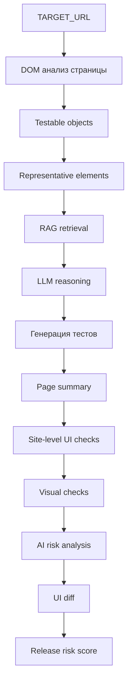

# AI Release Guardian

AI Release Guardian — прототип нейро-сотрудника для анализа веб-интерфейсов и оценки рисков изменений между релизами.

Система автоматически анализирует структуру веб-страницы, декомпозирует интерфейс на тестируемые элементы и использует LLM для генерации тестов и выявления потенциальных зон регрессии.

Проект демонстрирует применение **RAG-архитектуры**, **LLM reasoning** и **DOM-анализа интерфейса** для задач QA-аналитики.

---

# Цель проекта

Основная цель системы — помочь QA-инженеру автоматизировать анализ интерфейса и подготовку тестирования перед релизом.

AI Release Guardian позволяет:

- анализировать структуру DOM веб-страницы
- выделять testable objects (тестируемые элементы интерфейса)
- генерировать тестовые сценарии
- выявлять потенциальные зоны риска
- анализировать изменения интерфейса между версиями сайта
- оценивать release risk

---

# Архитектура системы

Архитектура проекта построена по принципу:

**Code extracts facts → LLM performs reasoning**

Это позволяет снизить вероятность галлюцинаций модели, поскольку LLM работает с реальными структурированными данными интерфейса.

## Общий pipeline системы


# Основные компоненты системы

## DOM-анализ страницы

Система получает HTML веб-страницы и извлекает структуру интерфейса.

Используемые технологии:

- Selenium — загрузка страницы
- BeautifulSoup — анализ DOM

На этом этапе извлекаются основные элементы интерфейса:

- input  
- button  
- form  
- link  
- table  
- image  

---

## Декомпозиция интерфейса

DOM преобразуется в **testable objects** — нормализованные элементы интерфейса, пригодные для тестирования.

Примеры:
##
```
Sites/
site_name/
runs/
run_001/
run_002/
run_003/
```

Каждый run содержит артефакты анализа.

---

# Артефакты запуска

В папке run сохраняются:

- testable_objects.json  
- representative_elements.json  
- generated_test_cases.json  
- site_risk_analysis.json  
- ui_diff_report.json  
- run_summary.json  

Это позволяет анализировать историю изменений интерфейса.

---

# Diff-анализ интерфейса

Система сравнивает DOM между двумя запусками.

Определяются:

- добавленные элементы
- удалённые элементы
- изменённые элементы

После этого LLM выполняет **AI-анализ изменений** и выявляет потенциальные зоны регрессии.

---

# Release Risk Score

На основе diff интерфейса вычисляется метрика **Release Risk Score**, которая помогает оценить потенциальную опасность изменений.

Score учитывает:

- количество добавленных элементов
- количество удалённых элементов
- количество изменённых элементов

Это позволяет QA-инженеру быстрее определить приоритеты тестирования.

---

# Используемые технологии

- Python  
- Selenium  
- BeautifulSoup  
- LlamaIndex  
- Sentence Transformers  
- HuggingFace Embeddings  
- Transformers  
- VSEGPT API  

---

# Итог

AI Release Guardian демонстрирует архитектуру нейро-сотрудника, который помогает QA-инженеру анализировать интерфейсы и выявлять потенциальные риски перед релизом.

Проект объединяет:

- DOM-анализ интерфейса
- RAG-архитектуру
- LLM reasoning
- diff-анализ интерфейсов

и показывает возможный подход к построению **AI-инструментов для QA-аналитики**.
