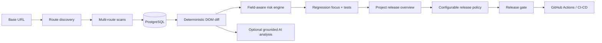

# AI Release Guardian V2

AI Release Guardian is a QA release-analysis platform that captures real web interfaces, compares releases, prioritizes regression risk, generates deterministic regression tests, and exposes a configurable quality gate for CI/CD.

The core principle is simple:

**Code extracts facts → deterministic QA logic evaluates changes → AI adds grounded reasoning.**

The release decision does not depend on an LLM. DOM diff, risk scoring, regression focus, generated test cases, route readiness, and the release gate all work deterministically.

## What V2 does

- captures pages with Playwright and extracts normalized testable DOM objects;
- stores projects, scans, baseline/current/history state in PostgreSQL;
- compares baseline vs current per route;
- preserves path + query as route identity while ignoring URL fragments;
- calculates field-aware deterministic release risk;
- explains risk contribution down to changed DOM fields;
- builds prioritized regression focus and executable-style test cases without an LLM;
- exports regression tests as JSON, Markdown, and Playwright TypeScript;
- discovers same-origin routes from a site;
- runs resilient multi-route baseline/current batch scans;
- summarizes release readiness across all routes;
- applies a configurable release policy;
- exposes a machine-readable release gate that can block deployment;
- optionally adds grounded AI analysis as a separate layer.

## Project evolution: V1 → V2

Guardian was intentionally developed in stages rather than replaced with a polished one-shot implementation. The previous project state is preserved on the `v1-legacy` branch, while `main` contains the current V2.

| Area | Earlier V1 | Current V2 |
| --- | --- | --- |
| Scope | initial release-analysis prototype | end-to-end QA release-analysis platform |
| Comparison | early page/change analysis | route-scoped deterministic DOM diff |
| Risk | initial prioritization | field-aware weighted risk with element-level contribution |
| Regression | analysis-oriented output | deterministic focus + structured test cases + Playwright export |
| Coverage | primarily individual scans | same-origin route discovery + resilient multi-route batch scans |
| State | prototype-oriented workflow | PostgreSQL persistence + Alembic + baseline/current/history lifecycle |
| Release decision | analysis for a reviewer | configurable deterministic project release gate for CI/CD |
| AI | part of the experiment | optional grounded layer, explicitly separated from release-critical logic |
| Reliability | prototype safeguards | rollback behavior, DB invariants, sanitized failure contracts, integration/CI coverage |

The important progression is not just additional features. V2 moves release-critical decisions into deterministic, testable code and treats AI as supplemental reasoning rather than an authority.

**Explore the evolution:** switch to the `v1-legacy` branch to inspect the earlier implementation, then return to `main` for the current architecture. The merged V2 pull request also preserves the implementation and CI review trail.

## Quick Start

### Docker Compose

Requirements: Docker with Compose support.

```bash
git clone https://github.com/Stasikent/AI-Release-Guardian---.git
cd AI-Release-Guardian---
docker compose up --build
```

Then open:

- Frontend: `http://localhost:3000`
- FastAPI: `http://localhost:8000`
- API docs: `http://localhost:8000/docs`

PostgreSQL is started automatically. The deterministic workflow does **not** require an LLM API key. AI analysis is optional; configure the `LLM_*` environment variables only when you want to use that layer.

To stop the stack:

```bash
docker compose down
```

Use `docker compose down -v` only when you intentionally want to remove the local PostgreSQL volume as well.

## API examples

Create a project:

```bash
curl -X POST http://localhost:8000/api/v1/projects \
  -H "Content-Type: application/json" \
  -d '{"name":"Demo shop","base_url":"https://example.com"}'
```

Discover routes:

```bash
curl -X POST http://localhost:8000/api/v1/projects/1/routes/discover \
  -H "Content-Type: application/json" \
  -d '{"url":"https://example.com","max_routes":20}'
```

Run a multi-route baseline:

```bash
curl -X POST http://localhost:8000/api/v1/projects/1/scans/batch \
  -H "Content-Type: application/json" \
  -d '{"base_url":"https://example.com","routes":["/","/login","/checkout"],"role":"baseline"}'
```

After scanning the newer version as `current`, evaluate the CI gate:

```bash
curl http://localhost:8000/api/v1/projects/1/release-gate
```

## Architecture


```mermaid
flowchart LR
    URL[Base URL] --> DISC[Route discovery]
    DISC --> BATCH[Multi-route scans]
    BATCH --> DB[(PostgreSQL)]
    DB --> DIFF[Deterministic DOM diff]
    DIFF --> RISK[Field-aware risk engine]
    RISK --> REG[Regression focus + tests]
    REG --> OVERVIEW[Project release overview]
    OVERVIEW --> POLICY[Configurable release policy]
    POLICY --> GATE[Release gate]
    GATE --> CI[GitHub Actions / CI-CD]
    DIFF --> AI[Optional grounded AI analysis]
```

### Backend

FastAPI provides project, scan, comparison, export, route-discovery, batch-scan, release-overview, policy, and release-gate APIs. SQLAlchemy + Alembic manage persistence and migrations. Playwright performs browser capture behind public-URL/SSRF safeguards.

### Frontend

Next.js + TypeScript provides the project workflow, route discovery, selectable batch scans, release overview, risk inspection, policy controls, regression output, and exports.

### QA engine

The deterministic layer owns release-critical behavior. Changed fields receive explicit weights, affected elements are ranked by risk contribution, and regression cases are generated from observable DOM facts. AI analysis is supplemental rather than authoritative.

## End-to-end demo

A reviewer can understand the project with this workflow:

1. Create a project and provide a public target/base URL.
2. Use **Discover routes** to collect unique same-origin pages.
3. Select relevant routes and run **Batch baseline**.
4. Change or deploy a newer version of the target application.
5. Run **Batch current** against the same routes.
6. Open **Project Release Overview**. Each route is reported as `READY`, `MISSING_BASELINE`, or `MISSING_CURRENT`.
7. Inspect deterministic DOM changes, field-level risk contributions, regression focus, and generated regression tests.
8. Configure the policy: block on `HIGH` or `CRITICAL`, set the maximum risk score, and decide whether every discovered route must be complete.
9. Evaluate the project release gate.
10. Allow CI/CD to continue only when Guardian returns `allowed=true`.

A failed page does not abort an entire batch. Guardian records the route failure and continues scanning the remaining selected routes. Batch routes are constrained to the configured origin.

## Example release decision

```
/login              LOW       8/100   READY
/products?page=2    MEDIUM    31/100   READY
/checkout           HIGH      62/100   READY

Policy:
  block_on = HIGH
  max_risk_score = 70
  require_all_routes = true

Release gate:
  BLOCKED
  Reason: at least one route meets the configured HIGH threshold.
```

The important distinction is that the gate is derived from deterministic scan/diff data. An unavailable or differently behaving LLM does not change the deterministic gate result.

## CI/CD release gate

`GET /api/v1/projects/{project_id}/release-gate`

Example:

```json
{
  "project_id": 1,
  "status": "READY",
  "allowed": true,
  "exit_code": 0,
  "reason": "Comparable routes satisfy the configured deterministic release policy.",
  "overall_risk_score": 18,
  "overall_risk_level": "LOW",
  "comparable_routes": 3,
  "incomplete_routes": 0
}
```

`READY` maps to `allowed=true` and `exit_code=0`. `BLOCKED` and `INCOMPLETE` map to `allowed=false` and `exit_code=1`. A successfully evaluated gate returns HTTP 200 so CI can distinguish a release-policy failure from an API/transport failure.

A ready-to-run GitHub Actions example is included in `.github/workflows/release-gate-example.yml`. A deployment job can depend on that gate job with `needs: release-gate`.

## Generated regression artifacts

For a comparable route Guardian can produce:

- deterministic regression priorities;
- structured regression test cases;
- JSON export;
- Markdown export;
- Playwright `.spec.ts` export with field-aware assertions.

A project-wide multi-route Playwright suite can also be exported for the comparable routes.

## Safety and failure behavior

- browser navigation is checked by public-URL validation;
- browser requests are guarded against unsafe targets;
- route discovery keeps only same-origin HTTP/HTTPS links;
- batch scans accept relative routes and verify the resolved target remains on the configured origin;
- failed scans do not archive a valid baseline/current before browser capture succeeds;
- batch failures are isolated per route;
- database mutations use rollback on failure.

## Stack

**Backend:** Python, FastAPI, SQLAlchemy, Alembic, PostgreSQL, Pydantic, Playwright  
**Frontend:** Next.js, React, TypeScript  
**Testing/CI:** pytest, integration tests, Docker Compose, GitHub Actions  
**AI layer:** optional LLM analysis grounded in deterministic project data

## Why this project is useful for QA

AI Release Guardian V2 combines several tasks that are often separate in a QA workflow: interface inventory, release comparison, regression prioritization, test generation, multi-page readiness, and CI quality gates. It also makes the boundary between deterministic automation and AI reasoning explicit.

The project is a portfolio/demo system, not a substitute for product-specific QA judgment. Generated checks should be reviewed and supplemented with business-flow, visual, backend, accessibility, performance, and security testing where relevant.
